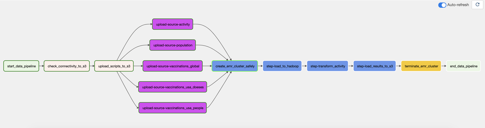

# COVID-19 Capstone Project

## Description
The purpose of the project is to combine what we've learned throughout the program.
I took several COVID-19 datasets and joined them to make a useful source of 
information regarding COVID-19 spread globally. I focus on:
- cases
- deaths
- vaccinations: how many doses were given, and how many people are considered vaccinated and what stage

I use 3 several time series data sources (see details below) and join them based on countries and dates. 

## Technology Stack

- Storage: Amazon S3, Hadoop
- Running environment: Amazon EMR
- Pipeline: Apache Airflow
- Packages: pyspark

I choose Amazon S3 - Amazon EMR combination instead of Amazon Redshift mainly because of these
terms:

- Cost: The project doesn't require a cluster to be open 24x7 like Redshift's.
- Data lake: Don't want to work on a traditional data warehouse structure, highly structured joins
  or staging steps.
- Ability to work with different unstructured data formats and potential for big data analytics are
  the other reasons of my choice.


## Data sources

### Source 1 - COVID-19 Activity

[Data.world](https://data.world/covid-19-data-resource-hub/covid-19-case-counts)

A global time series of cases and death counts.
This data is sourced from JHU CSSE COVID-19 Data as well as The New York Times.

**Schema**

- *people_positive_cases_count* - Number of people who have tested positive for all times

- *county_name* - The county name (US only)

- *province_state_name* - The state or province name

- *report_date* - The date of the report

- *continent_name* - The continent name

- *data_source_name* - Short description of the data source from which the record is sourced

- *people_death_new_count* - Number of people who have died for each day

- *county_fips_number* - County-level FIPS code, uniquely identifying geographic areas (US only)

- *country_alpha_3_code* - ISO3166-1 value. The three-letter code that represents a country name

- *country_short_name* - The country name

- *country_alpha_2_code* - ISO3166-1 value. The two-letter code that represents a country name
  
- *people_positive_new_cases_count* - Number of people who have tested positive for each day
 
- *people_death_count* - Number of people who have died for all times


full dictionary in [link](https://data.world/covid-19-data-resource-hub/covid-19-case-counts/workspace/data-dictionary)

### Source 2 - Location Population

[Data.world](https://data.world/covid-19-data-resource-hub/covid-19-activity-location-population-table)

This location and population table compliments the COVID-19 Activity dataset. This data is sourced from U.S. Census Bureau, Population Division (2019 estimate), the United Nations, Department of Economic and Social Affairs, Population Division (2019 median), and Statistics Canada (2019 estimate).

**Schema**
- *COUNTRY_SHORT_NAME* - The country name
- *COUNTRY_ALPHA_3_CODE* - ISO3166-1 value. The three-letter code that represents a country name
- *COUNTRY_ALPHA_2_CODE* - ISO3166-1 value. The two-letter code that represents a country name

- *PROVINCE_STATE_NAME* - The state or province name

- *COUNTY_NAME* - The county name (US only)

- *COUNTY_FIPS_NUMBER* - Count-level FIPS code, uniquely identifying geographic areas (US only)

- *GEO_LATITUDE* - Latitude for the geographic entity

- *GEO_LONGITUDE* - Longitude for the geographic entity

- *GEO_REGION_POPULATION_COUNT* - Population for the geographic entity

- *DATA_SOURCE_NAME* - name of data source

full dictionary in [link](https://data.world/covid-19-data-resource-hub/covid-19-activity-location-population-table/workspace/data-dictionary)

### Source 3 - COVID vaccinations

[Github - global](https://github.com/govex/COVID-19/tree/master/data_tables/vaccine_data/global_data)
[Github - us only](https://github.com/govex/COVID-19/tree/master/data_tables/vaccine_data/us_data/time_series)

This is an hourly ETL aggregating vaccination data from many sources worldwide.
The focus in this dataset is people vaccination status and doses administered.


**Schema**
- *Country_Region* - Country or region name
- *Date* - Data collection date

- *Doses_admin* - "Cumulative number of doses administered. When a vaccine requires multiple doses, each one is counted independently"
- *People_partially_vaccinated* - "Cumulative number of people who received at least one vaccine dose. When the person receives a prescribed second dose, it is not counted twice"
- *People_fully_vaccinated* - Cumulative number of people who received all prescribed doses necessary to be considered fully vaccinated
- *Report_Date_String* - Data reported date

## Data Schema

### Why I choose this schema
This schema is optimized for OLAP queries about geo positions of COVID-19 activity world wide.
The ETL I created joins the Continent, Population, and Geo positioning from 5 different data sources so the Users of this data can make queries regarding statistics (like mean, std, correlations etc) of covid activity. Also, I join different features from different table on the same time-series index - meaning, the Users of this data can now see how the different features related to each other, visualize the features together in interesting ways etc.

### Schema design
The Schema is designed as on big Fact table and several smaller dimentions to support it.
The reason for that is that OLAP doesn't do joins well, so the Fact table holds everything
needed for big data queries. 

The Fact table index is: Time, and Geo locaiton (continent, country, province). It is optimized for time-series queries - how the COVID19 changes over time, worldwide. 


### Fact - Worldwide Covid19 Activity
all activity information

```
schema:
 |-- country: string (nullable = true) - country related to information
 |-- date: string (nullable = true) - date of the information
 |-- province: string (nullable = true) - province related to information
 |-- people_positives_cases_count: long (nullable = true) - how many total positives?
 |-- people_death_new_count: long (nullable = true) - new deaths count for the date
 |-- people_positive_new_cases_count: long (nullable = true) - how many positives to the date?
 |-- people_death_count: long (nullable = true) - total death count
 |-- data_source_name: string (nullable = true) - what is the name of the source of the information
 |-- population: string (nullable = true) - what is the population in the region
 |-- people_partially_vaccinated: integer (nullable = true) - count of partlly vaccinated (total)
 |-- people_fully_vaccinated: integer (nullable = true) - count of fully vaccinated (total)
 |-- doses_admin: long (nullable = true) - count of vaccinations administration
 |-- continent: string (nullable = true) - what continent for the region
 |-- geo_latitude: double (nullable = false) - geo lat
 |-- geo_longitude: double (nullable = false) - geo long
```

### Dim - continent
- unique continent and geo position

schema:
```
 |-- continent_name: string (nullable = true) - name of continent
 |-- geo_latitude: double (nullable = true) - geo lat
 |-- geo_longitude: double (nullable = true) - geo long
 ```


### Dim - data sources
unique data sources on activity table

schema:
```
 |-- DATA_SOURCE_NAME: string (nullable = true) - name of data source
```

### Dim - countries
country name, iso, continent, geo position

```
 |-- continent: string (nullable = true) - name of continent
 |-- country: string (nullable = true) - name of country
 |-- province: string (nullable = true) - name of province
 |-- population: long (nullable = true) - what is the population in the region
 |-- geo_latitude: double (nullable = true) - lat
 |-- geo_longitude: double (nullable = true) - long
```

### Dim - Vaccination types
- get from vaccinations usa table the types

schema:
```
 |-- Vaccine_Type: string (nullable = true) - name of the vaccination manufactur
```

## ETL

### In General:
1. The pipeline uploads data from sources to s3
2. The pipeline uploads scripts from local machine to s3 for EMR workers to pick it up
3. The pipeline creates EMR cluster and waits to steady state
4. The pipeline sends EMR steps, each step is waited to be finished.
5. The pipeline terminates EMR cluster.

 

### Cleaning

1. Missing timeseries in all time-series source needs to be filled up by previous valid value.
2. Ignore rows with no valuable information


### ETL Transform Steps

In order to get the our final data model from the raw sources we perform the following steps:

1. create dim_continent table from 'activity' data source: use `CONTINENT_NAME`. join in with `Country_name` on population table to infer geo location. Average the latitude and longitude of the countries in order to get an estimate Geo position of the Continent.

2. create dim_data_sources table from `activity` source, on the `DATA_SOURCE_NAME` column and `population` source, on the `DATA_SOURCE_NAME` column.
3. create dim_vaccinations_types from `vaccinations_usa_doeses` source, on the `Vaccine_Type` column
4. create dim_countries table from
    - `population` source
    - `df_vaccinations_global` source
    - `df_vaccinations_usa_doeses` source
    - `df_vaccinations_usa_people` source
5. create fact table `fact_cov19_activity` from
    - `activity` source - get the infections and deaths count
    - `population` source - get population and geo location
    - `df_vaccinations_global` source - fetch doeses adminstration and people vaccinated status worldwide
    - `df_vaccinations_usa_doeses` source - fetch doeses adminstration in USA
    - `df_vaccinations_usa_people` source - fetch people vaccinated status in USA

## Answers to questions

### How often the data should be updated and why
This data should be updated every hour, as the most frequent data source is hourly.

### The data was increased by 100x.
- Because the data sources are copied, the copy will take more time. the data is created as a whole snapshot for today.
- the ETL will need to use more workers for spark to finish the task faster.

### The data populates a dashboard that must be updated on a daily basis by 7am every day.
- The ETL should export the tables not to S3 but to some hot database where the data can be queries.
- The update should take place long before 7am.

### The database needed to be accessed by 100+ people.
There are several options:
- Spark access - manage the cluster to support this amount of connections and work.
- Use Serverless Query engine like Athena.
- Move to a dataware house.


## Data quality check

It's important to make test on the results because we are saving raw parquet and no database keeps any restrictions for us.

### Unique Keys restriction
Check that uniqueness of key columns is correct.

- Fact-activity - check that date+country+province is unique
- Dim-countries - check that continent+country+province is unique
- Dim-continent - check that continent name is unique
- Dim-data-source- -check that data source is unique
- Dim-vaccination types - check that the names of the vaccinations types are unique

### Null restrictions
Check that some coulmns cannot be null

- Fact-activity - date can't be null and country can't be null
- Dim-countries - continent and country can't be null
- Dim-continent - continent name can't be null
- Dim-data-source- -data source can't be null
- Dim-vaccination types - check that the names of the vaccinations types are not null


## Sample Queries

### Get the latest report on doses administration from Missisiippii
```
df_cov19_fact_activity_renames.filter(
    (F.col('province') == 'Mississippi') & (F.col('doses_admin')>0)
    ).orderBy(F.desc(F.col('date'))).select('date', 'doses_admin').head(1)
```

results:

[Row(date='2021-09-19', doses_admin=**2703278**)]

### What continent has the most positive cases of population?

```
df_cov19_fact_activity_renames.where("date='2021-09-19'").groupBy('continent').agg(
    F.sum('people_positives_cases_count'),
    F.sum('population')
).withColumn('res',
    F.col('sum(people_positives_cases_count)') / F.col('sum(population)')
).orderBy(F.desc(F.col('res'))).show()
```

results:
```
+---------+---------------------------------+---------------+--------------------+
|continent|sum(people_positives_cases_count)|sum(population)|                 res|
+---------+---------------------------------+---------------+--------------------+
|  America|                         88250856|  1.006353878E9| 0.08769366117551743|
|   Europe|                         59060747|   7.65383598E8| 0.07716489764652626|
|     Asia|                         72770282|  4.513214458E9|0.016123825419155385|
|   Africa|                          8230674|  1.307475657E9|0.006295087756268643|
|  Oceania|                           203451|    4.4253674E7|0.004597380999371939|
|     null|                             1332|           null|                null|
+---------+---------------------------------+---------------+--------------------+
```

**The Continet with most positive cases is America with 8.76% infections**

### What continent has the most vaccination precentage of population?

```
df_cov19_fact_activity_renames.where("date='2021-09-19'").groupBy('continent').agg(
    F.sum('people_fully_vaccinated'),
    F.sum('population')
).withColumn('res',
    F.col('sum(people_fully_vaccinated)') / F.col('sum(population)')
).orderBy(F.desc(F.col('res'))).show()
```

results:
```
+---------+----------------------------+---------------+-------------------+
|continent|sum(people_fully_vaccinated)|sum(population)|                res|
+---------+----------------------------+---------------+-------------------+
|   Europe|                   384128780|   7.65383598E8| 0.5018774651086787|
|  America|                   399726989|  1.006353878E9| 0.3972032082734221|
|     Asia|                   564053300|  4.513214458E9|0.12497817359424936|
|  Oceania|                     2024326|    4.4253674E7|0.04574368220817101|
|   Africa|                    50804099|  1.307475657E9|0.03885663088869271|
|     null|                           0|           null|               null|
+---------+----------------------------+---------------+-------------------+
```

***The Continent with most fully vaccinated people is Europe with over 50% vaccinated population***


## Sources
https://github.com/josephmachado/spark_submit_airflow